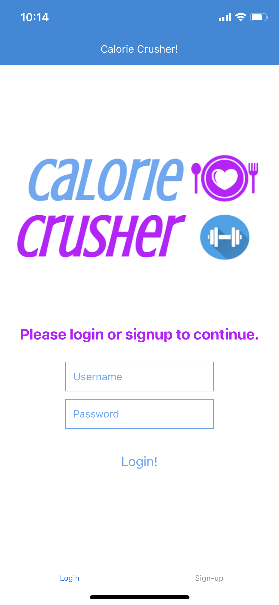
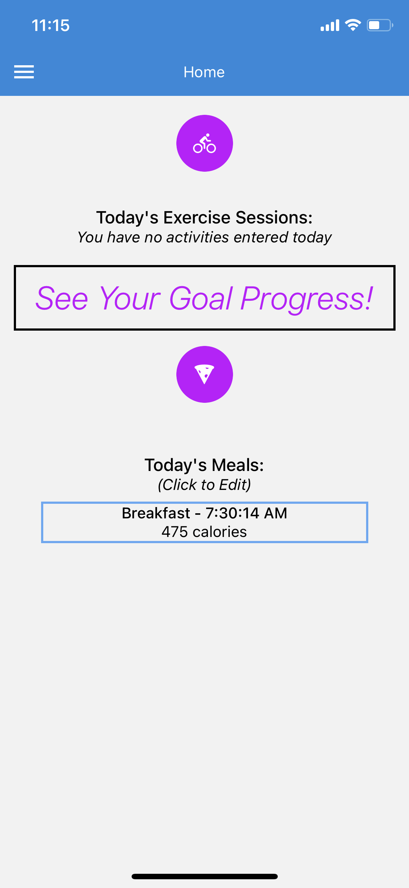
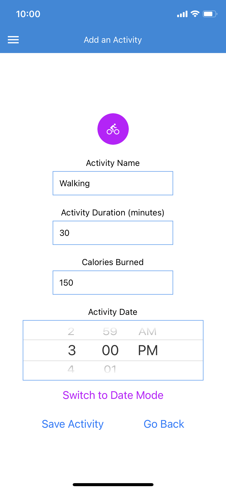
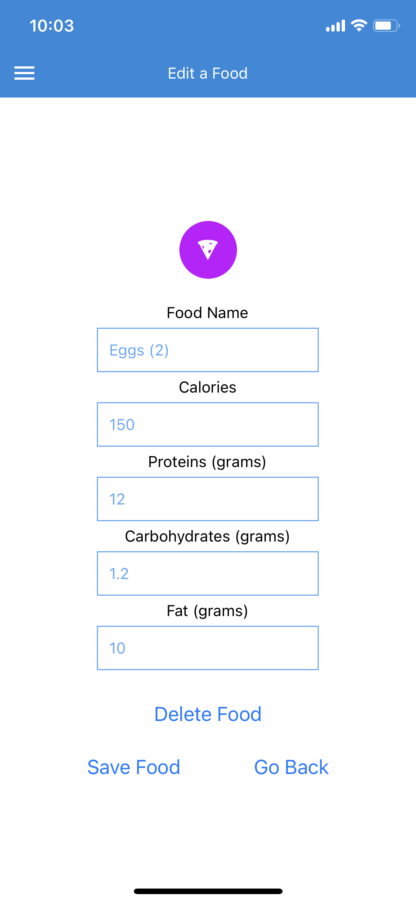
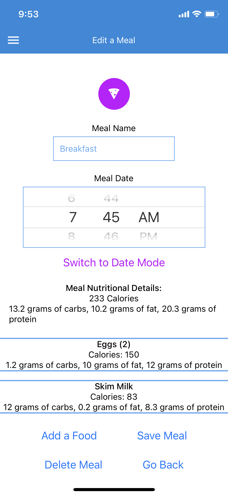
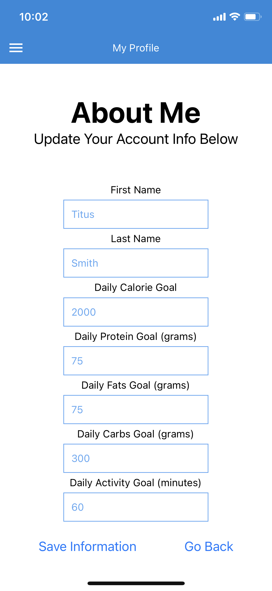
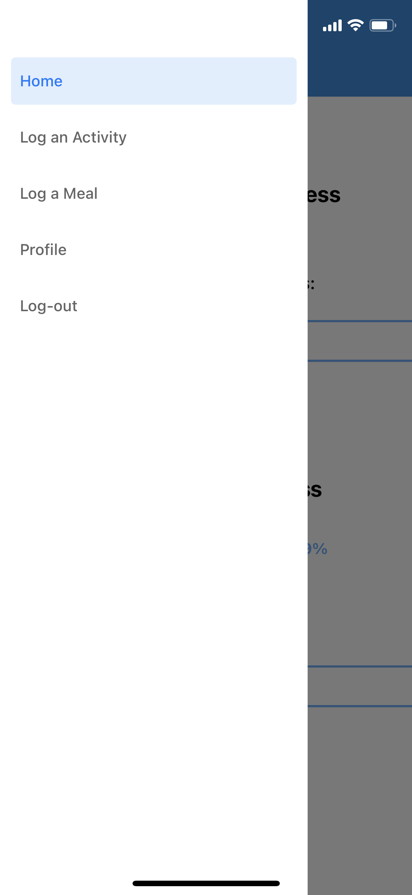

# Calorie Crusher
Created a fitness and meal tracking mobile app with React Native in tangent with an existing RESTful API. Users are able to set nutrition and activity goals, log meals, log activity sessions, and track daily progress to goals. Integrated accessibility features to support screen reader use. Sample screenshots below.

<table>
  <tr>
    <td>Login_Screen</td>
     <td>Today_Screen</td>
     <td>Add_ActivityScreen</td>
  </tr>
  <tr>
    <td></td>
    <td></td>
    <td></td>
  </tr>
  <tr>
    <td>Edit_FoodScreen</td>
     <td>Edit_MealScreen</td>
     <td>Profile_Screen</td>
  </tr>
  <tr>
    <td></td>
    <td></td>
    <td></td>
  </tr>
  <tr>
    <td>Drawers_Navigation</td>
  </tr>
  <tr>
    <td></td>
  </tr>
 </table>

